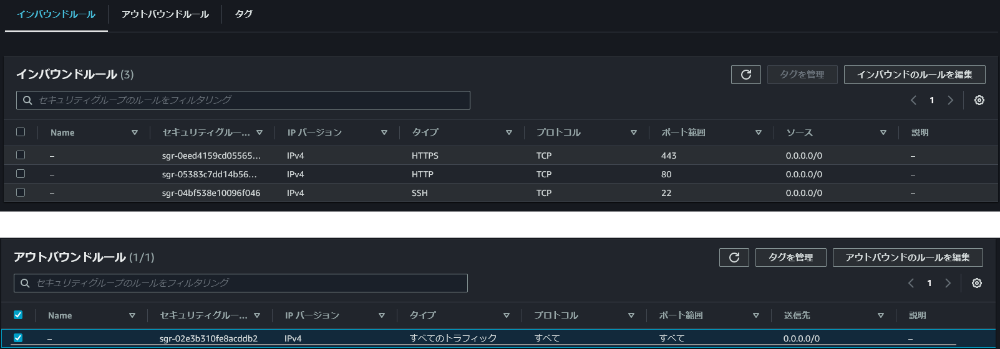

## やりたいこと

Docker で node コンテナと nginx コンテナを各々起動して、以下を実現したい。

node コンテナ: アプリケーションを `localhost:3000` で起動する。\
nginx コンテナ: クライアントからのhttpのリクエストに対して、`node:3000` を返す。\
クライアント: `http://サーバーの外部IPアドレス/`でアクセスする。

## 構成について

### インフラ

AWS EC2インスタンス * 1

セキュリティグループの設定


[インスタンスとセキュリティグループの詳細.yml](./docs/ec2-describe.yml)

### アプリケーション

- Amazon Linux 2023
- Docker version 24.0.5, build ced0996
- Docker Compose version v2.22.0

[アプリケーション情報の詳細.toml](./docs/installed-applications-version.toml)

```sh
docker-compose build
docker-compose up
```
